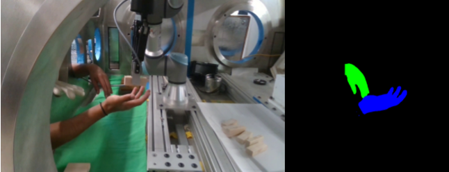

# The Collection of a Human Robot Collaboration Dataset for Cooperative Assembly in Glovebox Environments

This repository contains the code for our paper, and allows for the plug-and-play training and testing of models using the HAGS dataset.

## Contents

1. Setup Instructions
2. Training
3. Testing
4. Generating New Data Examples

## Setup Instructions

To setup modules, run `pip install -e .`

Create a python environment using the `requirements.txt` or `environment.yml`

Download the dataset from the [Texas Data Repository](https://dataverse.tdl.org/dataset.xhtml?persistentId=doi:10.18738/T8/85R7KQ) such that the `Dataset` folder is on the same level as the `training` folder. 

## Training

Training of models are done using the configs in the `training/training_configs` folder.

To train, see examples in `trainer.sh`. Change the training config used dependent on which model architecture and which set of the data you would like to train. Parameters can be adjusted in respected model configs or in the command line for example with `python -m training.cli fit --config ./training/training_configs/bisenet_v2_gs.yml --data.batch_size=5 --trainer.fast_dev_run=True --ckpt_path=./lightning_logs/version_8/checkpoints/epoch=49-step=350.ckpt`

These commands use `/training/cli.py`, the relevant config files under `/training/training_configs`, and the models under `/training/lighting_trainers` and `/training/models`.

## Testing

`tester.sh` runs tests on the model described in the checkpoint path. Uncomment the commands under only one of the models at a time at a time to run experiments for all dataset configurations. For custom dataset configurations, comment out relevant datasets under `DATASET CONFIGURATIONS`.

View the outputted tensorboard logs using `tensorboard --logdir lightning_logs`

To run tests on model ensembles, run `python -m training.lightning_trainers.ensemble_model` after editing the model type [here](https://github.com/UTNuclearRobotics/assembly_glovebox_dataset/blob/45c52dcb4d2b49c24846c390b5d12e09007390e3/training/lightning_trainers/ensemble_model.py#L100). Checkpoints used are described in ensemble models' main method in `/training/lightning_trainers/ensemble_model.py`.

## Generating New Data

For sampling frames from the videos themselves, copy the contents from `Dataset/Cropped_Videos` folder from the downloaded TDR dataset into `data/videos` and adjust the sampling rate and run `video_to_img_sorter.py`. To generate a dataset, annotate these images with semantic labels and run `ls_export_to_multiclass.py` to obtain labels if using Label Studio, which will appear in `data/Labels`.

To generate new images with replaced green screen background, place the associated images from `Dataset/Sampled_Frames` into `data/images` and the associated ground truth labels from `Dataset/Annotations` into `data/Labels`. Then, run the `replace` method in the `GreenRemover` class in `data/convert_scripts/replace_green.py`.  Use the code under `if __name__ == '__main__':` for reference on a method to use. 

After obtaining images and labels, copy back into the respective folder in the `Dataset` directory (this what is used by default in the dataloaders for training).

To convert exported Label Studio projects and files to PNGs, run `ls_export_to_multiclass.py.` If so, the associated exported PNGs and JSON must be stored in the `/data/raw` folder, and must be matched to the participant and type of project by editing [these lines](https://github.com/UTNuclearRobotics/assembly_glovebox_dataset/blob/45c52dcb4d2b49c24846c390b5d12e09007390e3/data/convert_scripts/ls_export_to_multiclass.py#L176-L183).

To produce the dataset of replacing the green screen with images using the Label Studio raw project files, run `replace_green.py`. Note: you must edit [these lines](https://github.com/UTNuclearRobotics/assembly_glovebox_dataset/blob/45c52dcb4d2b49c24846c390b5d12e09007390e3/data/convert_scripts/replace_green.py#L293-L297) to match the Label Studio files (JSON and PNG export) in `/data/raw` to the participants and view type.

After running the above, all images should be saved in `/data/images` and all labels in `/data/Labels`. These can also be done by just copying in the files from the uploaded dataset, skipping the video and Label Studio raw steps.